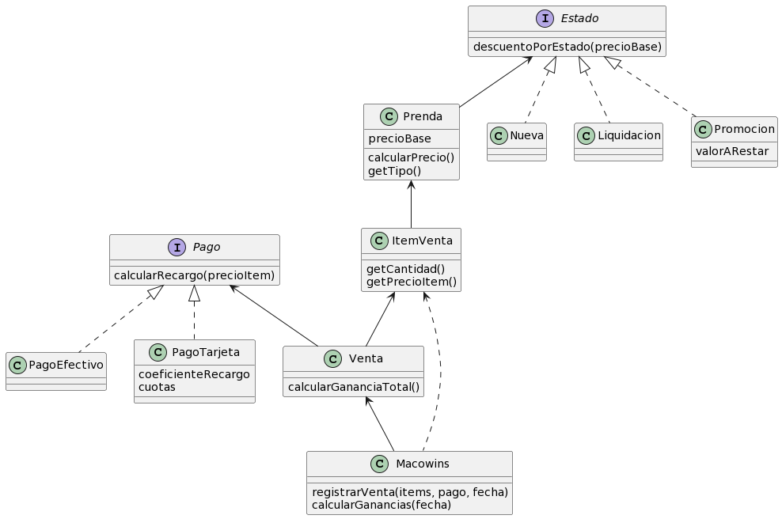

# dds-ej-clase-macowins

Ejercicio en clase del tp ["Macowins"](https://docs.google.com/document/d/1mjWKl9YH9Bb39iIUl1bQj_xhx_-CjCAMpcAXRqKhVjU/edit#heading=h.ijowozxsedv6)

## Solucion
  
### Alternativa 1:
---

### Requerimientos identificados
- Obtener *precio de venta* de una prenda
- Obtener *tipo* de una prenda
- Calcular *ganancias* de un *determinado dia*

### Diagrama

[Imagen](http://www.plantuml.com/plantuml/svg/PLB1JiCm3BtdAtBif6qVW3WCq8IG05NJnDrAlHBK9iD9nW7uTzncoQnncltYz_oUrqs8G36DWp83XA1RGjU1iYuY7S2Wtl90vy-lhmbFSAwVxMUo7HZhNUNwqOl-3LqiqqyHHzc_WF5VrWMngOM-x9dAxG5Dj2S9xO4-a2LKDgLlVzRhx4aYqfd4XR-2hbObSFwP466rL1dFMErh13d6MoeyEHP4ReiFcKx2_nFUw0w3IIpWMqyPR8w4dE8U0Ywo7HupC9Wq03s20sSix7s4eLcecfbdJZ1ukjiXgr3UU-7jq03rHNjAj53oam3zhRJMbzMAsyfkPvZNCTPZtDlZrFogwpy_Y_340xXeE-WgfQrx9R7SClC8UniY0SrQZUNXiDH73hBKVCvtcCMkBn6Q_5PLvQ6piF5uiCQoAfxlCAF9HmXCst3-D0v_)




<details>
<summary><h3>Pseudocodigo</h3></summary>


```java
class Prenda {
    var precioBase
    var tipo
    var estado

    method calcularPrecio() = precioBase - estado.descuentoPorEstado(precioBase)
    method getTipo() = tipo
}

interface Estado {
    method descuentoPorEstado(precioBase)
}

class Nueva implements Estado {
    method descuentoPorEstado(precioBase) = 0
}

class Liquidacion implements Estado {
    method descuentoPorEstado(precioBase) = precioBase * 0.5
}

class Promocion implements Estado {
    var valorARestar
    method descuentoPorEstado(precioBase) = valorARestar
}

class ItemVenta {
    var prenda 
    var cantidad
    var precioItem

    method getPrecioItem() = precioItem
    method getCantidad() = cantidad
}

class Venta {
    var items
    var fecha
    var pago

    method calcularGananciaTotal() = items.sum{item -> self.calcularPrecioDeVenta(item) * item.getCantidad()}
    method calcularGananciaItem(item) = item.getPrecioItem() + pago.calcularRecargo(item.getPrecioItem())
    method getFecha() = fecha 
}

interface Pago {
    method calcularRecargo(precioItem)
}

class PagoEfectivo implements Pago {
    method calcularRecargo(precioItem) = 0
}

class PagoTarjeta implements Pago {
    var coeficiente
    var cuotas
    
    method calcularRecargo(precioItem) = cuotas * coeficiente + 0.01 * precioItem
}

class Macowins {
    var ventas
    
    method registrarVenta(items, pago, fecha) {
        ventas.add(new Venta(items, pago, fecha))    
    }

    method calcularGanancias(fecha) = ventas.filter{venta -> venta.getFecha() == fecha}.sum{venta -> venta.calcularGananciaTotal()}
}
```
</details> 

---

  
### Preguntas:
* Registrar una venta puede ser un requerimiento?

### Explicacion:

Para el *primer requerimiento*, modelamos una prenda. Responde a “calcularPrecio” donde, a partir del precio base y el estado, se obtiene el precio de venta. El comportamiento particular del precio obtenido por cada estado lo delegamos en una clase que represente una abstraccion de cada uno. De esta manera, los estados son polimorficos y la prenda no tiene la responsabilidad de saber como manipula los valores cada estado.

Para el *segundo requerimiento*, utilizamos un atributo “tipo”, que se puede obtener con un getter.

Para el *tercer requerimiento*, `Macowins` responde a “calcularGanancias”, dada una fecha, utilizando sus ventas realizadas. 
  

### Aclaraciones:

-   `ItemVenta` es una clase que utilizamos para que se pueda registrar la cantidad vendida de una prenda, asi como su precio en ese momento. Conoce la prenda, pero si se intentara obtener el precio de la misma en una fecha diferente a la venta, el estado podria haber cambiado y el precio del `itemVenta` seria erroneo. 
    
-   `Venta` tiene las prendas vendidas de una determinada fecha y responde a “calcularGananciaTotal”. Para ello, utiliza al pago para calcular recargos posibles y a los items para obtener el precio por la cantidad.
    
-   `Pago` es una clase que representa la forma de pago. si fue en efectivo, no tiene recargo pero si fue con tarjeta, contamos con 2 atributos “cuotas” y ”coeficiente” que participan en el calculo del recargo. Al tener comportamientos diferentes elegimos una interfaz para que sea polimorfico
    

  

### Alternativa 2:
---

### Explicacion:

La diferencia con la alternativa anterior es que esta no utilizaria interfaces. Tanto `Estado` como `Pago` son clases que definen un comportamiento comun y comportamiento particular. Este comportamiento particular es implementado en cada subclase. Para `Estado` lo implementan `Nueva`, `Promocion`, `Liquidacion`. Para `Pago` lo implementan `PagoTarjeta`y `PagoEfectivo`. Por eso tambien se podria considerar que las clases en cuestion (`Estado` y `Pago`) son abstractas.
